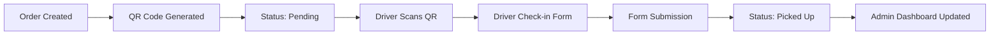

# 🚚 QR Code & Driver Pickup System - The JERK Tracker

## 📋 Overview

The JERK Tracker features a complete QR code-based driver pickup system that streamlines order management and delivery coordination. This contactless system allows drivers to self-check-in when picking up orders, providing real-time status updates and complete order tracking.

## 🔄 Complete Workflow Process

### **1. 📋 Order Creation**
**Restaurant Staff Actions:**
- Create new order through admin dashboard
- Choose between preset menu items or custom orders
- Enter customer details (name, email, order specifics)
- System automatically generates unique order ID and QR code

**System Actions:**
- Order saved to localStorage (GitHub Pages compatible)
- QR code generated linking to: `/orders/{orderId}`
- Order status set to `pending`

### **2. 🖨️ QR Code Display & Distribution**
**QR Code Contains:**
- Production URL: `https://teampaintbrush.github.io/thejerktrackerX/orders/{orderId}`
- Development URL: `http://localhost:3000/orders/{orderId}`

**Distribution Methods:**
- Display on admin dashboard QR tab
- Print with order receipt
- Show on restaurant display screen
- Send via email/SMS to delivery company

### **3. 🚚 Driver Arrival & QR Scan**
**Driver Process:**
1. Arrives at restaurant for pickup
2. Uses phone camera or QR scanner app
3. Scans QR code on receipt/display
4. Browser automatically opens order page

**Technical Flow:**
- QR code redirects to order-specific page
- Next.js routes to `OrderPage` component
- System loads order data using unique ID

### **4. 📱 Driver Check-in Interface**

#### **Order Information Display:**
```
Order #12345
👤 Customer: John Smith
🕐 Created: Sep 24, 2025 2:30 PM
📋 Status: Awaiting Pickup

Order Details:
2x Jerk Chicken Combo - $29.98
1x Rice & Peas - $4.99
1x Sweet Plantains - $3.99
Total: $38.96
```

#### **Driver Check-in Form:**
- **Driver Name** (required) - Text input for full name
- **Delivery Company** (required) - Dropdown selection:
  - UberEats
  - DoorDash
  - Grubhub
  - Postmates
  - Delivery Hero
  - Independent Driver
  - Other
- **Confirm Pickup Button** - Submits form and updates status

### **5. ✅ Pickup Confirmation Process**

#### **Form Validation:**
- Driver name must be filled
- Delivery company must be selected
- Real-time validation with error messages

#### **Submission Process:**
```javascript
// Order status update
const updatedOrder = {
  ...order,
  status: 'picked_up',
  driverName: 'John Driver',
  driverCompany: 'UberEats',
  pickedUpAt: new Date()
};
```

#### **Success Response:**
- Order status changes from `pending` → `picked_up`
- Pickup timestamp recorded
- Driver details saved
- Success message displayed
- Auto-redirect to home page after 3 seconds

### **6. 📊 Real-Time Admin Updates**

#### **Admin Dashboard Changes:**
- Order list updates status to "Picked Up"
- Order timeline shows pickup event
- Driver information displayed
- Pickup timestamp recorded

#### **Order Status Badges:**
- 🕐 **Pending**: Yellow badge, "Awaiting Pickup"
- ✅ **Picked Up**: Green badge, "Picked Up"

## 🎯 Key Features

### **🔒 Security & Validation**
- Unique order IDs prevent unauthorized access
- Form validation prevents incomplete submissions
- Client-side and server-side error handling

### **📱 Mobile Optimization**
- Responsive design for all screen sizes
- Touch-friendly interface for drivers
- Fast loading on mobile networks

### **🔄 Real-Time Synchronization**
- Instant status updates across all devices
- localStorage persistence for offline capability
- Automatic data refresh in admin dashboard

### **🎨 User Experience**
- Intuitive QR code scanning process
- Clear visual feedback for all actions
- Loading states and progress indicators
- Success/error toast notifications

## 📋 Order Status Lifecycle



## 🛠️ Technical Implementation

### **Frontend Components:**
- `OrderForm.tsx` - Order creation interface
- `QRCodeDisplay.tsx` - QR code generation and display
- `OrderPage.tsx` - Driver check-in interface
- `OrderList.tsx` - Admin order management
- `OrderTimeline.tsx` - Order status timeline

### **Data Storage:**
- `DynamoDBService.ts` - Data persistence layer
- localStorage for GitHub Pages compatibility
- JSON data structure for orders

### **QR Code Generation:**
```javascript
import { QRCodeCanvas } from 'qrcode.react';

const QRCodeDisplay = ({ orderId, orderNumber }) => {
  const basePath = process.env.NODE_ENV === 'production' ? '/thejerktrackerX' : '';
  const orderUrl = `${window.location.origin}${basePath}/orders/${orderId}`;
  
  return (
    <QRCodeCanvas value={orderUrl} size={200} />
  );
};
```

### **Order Data Structure:**
```typescript
interface Order {
  id: string;                    // Unique identifier
  orderNumber: string;           // Human-readable order number
  customerName: string;          // Customer information
  customerEmail: string;
  orderDetails: string;          // Order contents and pricing
  status: 'pending' | 'picked_up';
  createdAt: Date;              // Order creation timestamp
  pickedUpAt?: Date;            // Pickup timestamp
  driverName?: string;          // Driver information
  driverCompany?: string;
}
```

## 🚀 Deployment & URLs

### **Production (GitHub Pages):**
- Main App: `https://teampaintbrush.github.io/thejerktrackerX/`
- Admin Dashboard: `https://teampaintbrush.github.io/thejerktrackerX/admin`
- Order Pages: `https://teampaintbrush.github.io/thejerktrackerX/orders/{orderId}`

### **Development:**
- Main App: `http://localhost:3000/`
- Admin Dashboard: `http://localhost:3000/admin`
- Order Pages: `http://localhost:3000/orders/{orderId}`

## 📊 Analytics & Tracking

### **Order Metrics:**
- Total orders created
- Orders picked up vs pending
- Average pickup time
- Driver company distribution

### **Performance Metrics:**
- QR code scan success rate
- Form completion rate
- Page load times
- Error rates

## 🔧 Troubleshooting

### **Common Issues:**

#### **QR Code Not Working:**
- Verify order ID exists in system
- Check URL format and base path
- Ensure order hasn't been deleted
- Test QR code with different scanners

#### **Form Submission Errors:**
- Verify required fields are filled
- Check network connectivity
- Clear browser cache and localStorage
- Try different browser/device

#### **Status Not Updating:**
- Refresh admin dashboard
- Check localStorage data
- Verify order ID matches
- Check for console errors

### **Browser Compatibility:**
- Chrome/Edge: Full support
- Safari: Full support
- Firefox: Full support
- Mobile browsers: Optimized

## 🎯 Best Practices

### **For Restaurant Staff:**
- Print QR codes clearly and at adequate size
- Keep backup order information available
- Train staff on system usage
- Monitor pickup status regularly

### **For Drivers:**
- Use good lighting when scanning QR codes
- Double-check order details before confirming
- Enter accurate driver information
- Contact restaurant if QR code issues occur

### **System Maintenance:**
- Regular data backups
- Monitor error logs
- Update delivery company list as needed
- Test QR code generation periodically

## 📞 Support & Contact

For technical issues or questions about the QR Code & Driver Pickup system:

- **System Status**: All systems operational ✅
- **Last Updated**: September 24, 2025
- **Version**: 1.0
- **GitHub Repository**: [thejerktrackerX](https://github.com/TeamPaintbrush/thejerktrackerX)

---

*This system provides a seamless, contactless pickup experience that reduces wait times, improves accuracy, and provides complete order tracking for The JERK Tracker restaurant management system.*